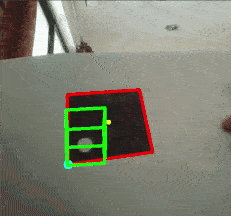

#AR demo
This is a demo of a simple augmented reality application using image processing. The aim of this project is purely educational. 

Dependencies: `numpy`, `cv2`, `pickle`

## Camera Calibration
First we find the intrinsic and extrinsic parameters of the camera using chessboard calibration in `calib.py`. This gives us the transformation matrix from the camera coordinates to the real world coordinates. We store these parameters in `camera.p`.

## Square detection and tracking
We start detection with `ip.py`. The box is placed inside the blue square, whose size can be changed with the keys 'a' and 's'. Once the box is inside the blue square, press 'd' to start detection. The image is blurred and then masked with a reverse threshold so that it can be tracked and the contours can be detected. Camshift algorithm is used to track the largest blob inside the blue square set earlier. This should be the square on the paper. The coordinates of the corners of the bounding box are found from the trackBox points returned by Camshift. Then the coordinates of the square are found by finding the closest polynomial fit for the contour with the largest area inside the bounding box. If a square is detected, then the coordinates are found, otherwise, the coordinates are set to (-1,-1), (-1,-1), (-1,-1), (-1,-1) which signifies an error. A green square is drawn showing the detected square on the paper. The centroid of the detected square is also found by finding the intersection of the diagonals and then it is shown.

To have the correct orientation, the square has an empty region in one quadrant. We use this information to get the vertices in the correct order. The corner corresponding to the quadrant with the empty region is the first corner and then the ordering for the remaining corners is clockwise. To check if a corner is in the clockwise or anticlockwise direction of the current corner, we check the cross product.
