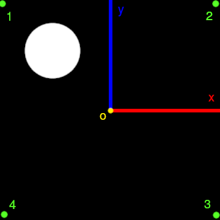

# AR demo
This is a demo of a simple augmented reality application using image processing. The aim of this project is purely educational. 

  

Dependencies: `numpy`, `cv2`, `pickle`

## Camera Calibration
First the intrinsic and extrinsic parameters of the camera are found using chessboard calibration in `calib.py`. This gives the transformation matrix from the camera coordinates to the real world coordinates. These parameters are stored in `camera.p`.

## Square detection and tracking
The pattern which is used for detection and tracking is a black square drawn on a flat white sheet with a circular blank in one of its corners. This asymmetry is used in order to have a fixed orientation (ordered coordinates of the square are used to fix the axes and the origin is taken to be the center of the pattern) so that the base coordinate frame doesn't jump after every 90 degree rotation.

  

We start detection with `ip.py`. The pattern is placed inside the blue square, whose size can be changed with the keys 'a' and 's'. Once the pattern is inside the blue square, press 'd' to start detection and track the pattern. The image is blurred and then masked with a reverse threshold so that it can be tracked and the contours can be detected. Camshift algorithm is used to track the largest blob inside the blue square set earlier. This should be the pattern on the paper. The coordinates of the corners of the bounding box are found from the trackBox points returned by Camshift. Then the coordinates of the square are found by finding the closest polygon fit for the contour with the largest area inside the bounding box. If a square is detected, then the coordinates are returned, otherwise, the coordinates are set to (-1,-1), (-1,-1), (-1,-1), (-1,-1) which signifies an error. A red square is drawn around the pattern detected on the paper. The centroid of the detected pattern is also found by finding the intersection of the diagonals and then it is shown.

To have the correct orientation, the square has an empty region in one quadrant. This information is used to get the vertices in the correct order by checking for the quadrant with the least number of white pixels. The corner corresponding to the quadrant with the empty region is the first corner and then the ordering for the remaining corners is clockwise. To check if a corner is in the clockwise or anticlockwise direction of the current corner, the sign of the cross product of the vectors from the centroid to the two corners in question is checked. This gives us the two oriented axes and the origin in the image coordinates.

The coordinates are further smoothened by taking the average from the last three frames to avoid sudden jumps in the detected corners. 

## Drawing the cube

Finally, the coordinate transformation matrix obtained after the camera calibration is used to calculate the image coordinates of the cube with given world coordinates, which is then accordingly rotated and drawn on top of the detected square.
